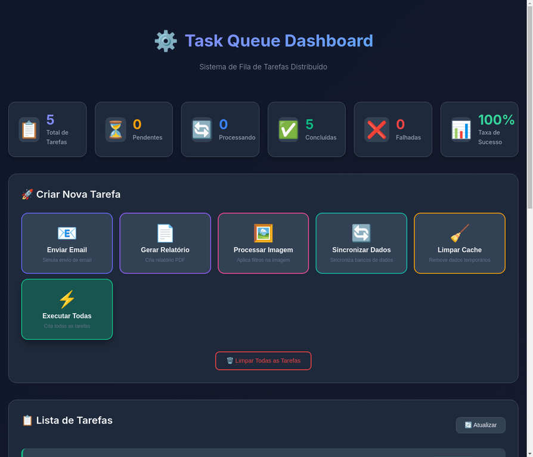

# ⚙️ Sistema de Fila de Tarefas Distribuído (Task Queue)

Um sistema robusto e profissional de **fila de tarefas assíncronas** com **Dashboard Web Visual**, demonstrando as melhores práticas em arquitetura de sistemas distribuídos.



---

## 🎯 Visão Geral

Este projeto implementa um sistema completo de fila de tarefas com:

- **Dashboard Web Visual** - Interface moderna e intuitiva para gerenciar tarefas
- **Processamento Assíncrono** - Tarefas executadas em background
- **Retry Automático** - Tentativas automáticas com exponential backoff
- **Priorização** - Suporte para prioridades (Alta, Média, Baixa)
- **Monitoramento** - Estatísticas em tempo real

---

## ✨ Funcionalidades

| Funcionalidade | Descrição |
|:---|:---|
| **Dashboard Web** | Interface visual para criar e monitorar tarefas |
| **5 Tipos de Tarefas** | Email, Relatório, Imagem, Sincronização, Limpeza |
| **Estatísticas em Tempo Real** | Total, Pendentes, Processando, Concluídas, Falhadas |
| **Taxa de Sucesso** | Cálculo automático da taxa de sucesso |
| **Botão "Executar Todas"** | Cria todas as tarefas de uma vez para teste |

---

## 🚀 Como Executar no Windows

### Pré-requisitos

1. **Python 3.8+** - [Download aqui](https://www.python.org/downloads/)
   - **IMPORTANTE:** Marque "Add Python to PATH" durante a instalação

2. **Git (opcional)** - [Download aqui](https://git-scm.com/downloads)

### Passo 1: Baixar o Projeto

**Opção A - Com Git:**
```powershell
git clone https://github.com/lucasandre16112000-png/04-task-queue.git
cd 04-task-queue
```

**Opção B - Sem Git:**
1. Acesse: https://github.com/lucasandre16112000-png/04-task-queue
2. Clique em "Code" → "Download ZIP"
3. Extraia o arquivo
4. Abra o PowerShell na pasta extraída

### Passo 2: Executar a Dashboard

**Opção A - PowerShell (Recomendado):**
```powershell
.\run_dashboard.ps1
```

> **Nota:** Se der erro de permissão, execute primeiro:
> ```powershell
> Set-ExecutionPolicy -ExecutionPolicy RemoteSigned -Scope CurrentUser
> ```

**Opção B - CMD (Duplo Clique):**
- Dê duplo clique no arquivo `run_dashboard.bat`

**Opção C - Manual:**
```powershell
pip install flask
python app.py
```

### Passo 3: Acessar o Painel

Abra seu navegador e acesse:
```
http://localhost:5000
```

---

## 📊 Como Usar a Dashboard

### Estatísticas (Topo)
- **Total de Tarefas** - Quantidade total de tarefas criadas
- **Pendentes** - Tarefas aguardando processamento
- **Processando** - Tarefas sendo executadas agora
- **Concluídas** - Tarefas finalizadas com sucesso
- **Falhadas** - Tarefas que falharam
- **Taxa de Sucesso** - Porcentagem de sucesso

### Criar Tarefas (Botões)
| Botão | Função |
|:---|:---|
| 📧 **Enviar Email** | Simula envio de email |
| 📄 **Gerar Relatório** | Simula criação de PDF |
| 🖼️ **Processar Imagem** | Simula aplicação de filtros |
| 🔄 **Sincronizar Dados** | Simula sync entre bancos |
| 🧹 **Limpar Cache** | Simula limpeza de dados |
| ⚡ **Executar Todas** | Cria todas as 5 tarefas |

### Lista de Tarefas
- Mostra todas as tarefas criadas
- Status em tempo real (Pendente → Processando → Concluída)
- Botão 🗑️ para remover tarefa individual
- Botão "Limpar Todas" para remover tudo

---

## 📁 Estrutura do Projeto

```
04-task-queue/
├── 📜 app.py                    # Servidor Flask (Dashboard)
├── 📜 worker_windows.py         # Versão terminal (sem dashboard)
│
├── 📂 templates/
│   └── index.html               # Página HTML da dashboard
│
├── 📂 static/
│   ├── css/style.css            # Estilos visuais
│   └── js/app.js                # JavaScript interativo
│
├── 📜 run_dashboard.bat         # Script para CMD
├── 📜 run_dashboard.ps1         # Script para PowerShell
├── 📜 run_windows.bat           # Script terminal (CMD)
├── 📜 run_windows.ps1           # Script terminal (PowerShell)
│
└── 📜 README.md                 # Este arquivo
```

---

## 🛠️ Tecnologias Utilizadas

| Tecnologia | Propósito |
|:---|:---|
| **Python 3.8+** | Backend e processamento |
| **Flask** | Servidor web e API REST |
| **HTML5/CSS3** | Interface visual |
| **JavaScript** | Interatividade |
| **Threading** | Processamento assíncrono |

---

## 🐛 Troubleshooting

### Erro: "python: command not found"
- Instale Python: https://www.python.org/downloads/
- Marque "Add Python to PATH" durante instalação

### Erro: "No module named 'flask'"
```powershell
pip install flask
```

### Erro de permissão no PowerShell
```powershell
Set-ExecutionPolicy -ExecutionPolicy RemoteSigned -Scope CurrentUser
```

### Porta 5000 em uso
- Feche outros programas usando a porta
- Ou edite `app.py` e mude `port=5000` para outra porta

---

## 👨‍💻 Autor

**Lucas André S**

- GitHub: [@lucasandre16112000-png](https://github.com/lucasandre16112000-png)

---

## 📄 Licença

Este projeto está sob a licença MIT.

---

**Desenvolvido com ❤️ por Lucas André S**
