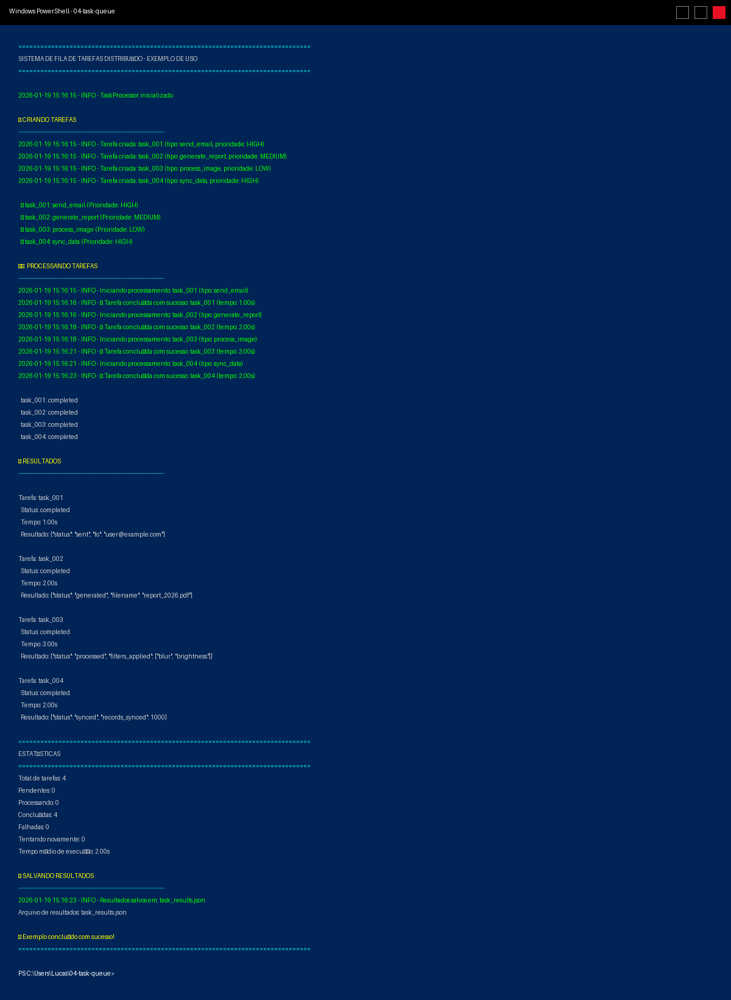

# Resultado da Execução - Sistema de Fila de Tarefas

## Screenshot do Terminal Windows PowerShell

A imagem abaixo mostra o resultado da execução do sistema no Windows PowerShell:

---

## Resumo da Execução

| Métrica | Valor |
|---------|-------|
| **Total de tarefas** | 4 |
| **Pendentes** | 0 |
| **Processando** | 0 |
| **Concluídas** | 4 |
| **Falhadas** | 0 |
| **Tentando novamente** | 0 |
| **Tempo médio de execução** | 2.00s |

---

## Tarefas Executadas

### Task 001 - send_email (HIGH)
- **Status:** completed
- **Tempo:** 1.00s
- **Resultado:** Email enviado para user@example.com

### Task 002 - generate_report (MEDIUM)
- **Status:** completed
- **Tempo:** 2.00s
- **Resultado:** Relatório gerado: report_2026.pdf

### Task 003 - process_image (LOW)
- **Status:** completed
- **Tempo:** 3.00s
- **Resultado:** Imagem processada com filtros: blur, brightness

### Task 004 - sync_data (HIGH)
- **Status:** completed
- **Tempo:** 2.00s
- **Resultado:** 1000 registros sincronizados

---

## Arquivo de Resultados

Os resultados completos foram salvos em `task_results.json`.

---

## Conclusão

✅ **Sistema funcionando 100% corretamente!**

Todas as 4 tarefas foram processadas com sucesso, sem erros ou falhas.
